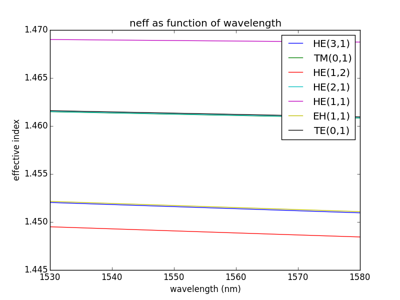
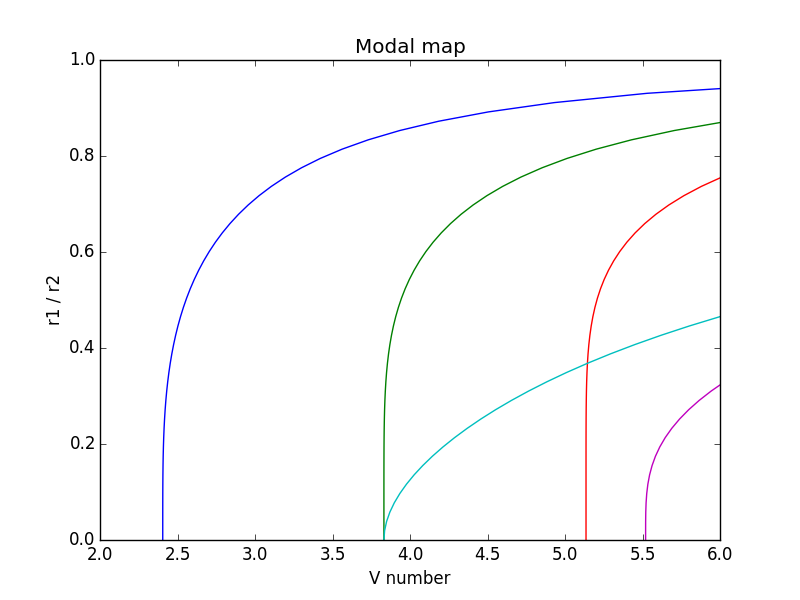

Using Simulator
===============

The :py:class:`~fibermodes.simulator.simulator.Simulator` allows to link
fibers with wavelengths, to simulate an array of parameters. It provides a
convenient way to compute a range of modal properties.

Counting modes and finding cutoffs
----------------------------------

In this first example, we simply want to find the cutoff of the different
supported modes, for a given fiber, at a given wavelength. We import the needed
modules, then we define our fiber::

    from fibermodes import FiberFactory, Simulator

    factory = FiberFactory()
    factory.addLayer(radius=10e-6, index=1.474)
    factory.addLayer()

Since we are dealing with only one fiber, and one wavelength, we could simply
generate the fiber from the factory, and directly use fiber functions to 
get the needed informations. However, we will use the simulator, to show
how it works. We build the simulator object, and we retrieve the list of
supported modes at 1550 nm::

    sim = Simulator(factory, [1550e-9])
    modes = next(sim.modes())[0]  # modes of first wavelength of next fiber
    print(", ".join(str(mode) for mode in sorted(modes)))
    print()

The simulator object takes two parameters: a fiber factory, and a list of
wavelengths. the :py:meth:`~fibermodes.simulator.simulator.Simulator.modes`
function returns an iterator, that will iterate on the modes of each generated
fiber. Since our factory only generates one fiber, we use the :py:func:`next`
function to return the first item generated by the iterator. The generated
items are lists; each list item is the solution for a given wavelength. Here
again, since we built the simulator with only one wavelength, returned lists
contain only one item, at index 0. Therefore, the modes variable is a
:py:class:`set`, containing the list of modes supported by the fiber at the
given wavelength. A :py:class:`set` has no order. However,
:py:class:`~fibermodes.mode.Mode`s are sortable. By using the
:py:func:`sorted` function, we iterate through the modes in an arbitrary, but
determined order (see :py:meth:`fibermodes.mode.Mode.__lt__` for details).

Now, to get the cutoffs, we proceed similarly. Cutoffs are independent of the
wavelength; however, we use the given wavelength to determine the list of
guided modes, and we only compute the cutoffs for those modes. Therefore,
if our simulator was using more than one wavelength, it would return a list
of cutoffs for each wavelength; the cutoffs would be the same, but some wavelength
could return cutoffs for more modes, if it supports more modes::

    cutoffs = next(sim.cutoff())[0]  # first wavelength of next fiber
    for mode, co in cutoffs.items():
        print(str(mode), co)

In this example, the cutoffs variable is a dictionary. Keys are the modes,
and values are the cutoffs, expressed as *V* number. We can also get cutoffs
as wavelengths::

    cutoffswl = next(sim.cutoffWl())[0]  # first wavelength of next fiber
    for mode, co in cutoffswl.items():
    	print(str(mode), str(co))

Plotting neff as function of the wavelength
-------------------------------------------

In this second example, we will plot neff as function of the wavelength, for a
single fiber. First, we import the modules we need, we define the list of
wavelengths we want to simulate, as well as the
:py:class:`~fibermodes.fiber.factory.FiberFactory` we will use::

    import numpy
    from matplotlib import pyplot
    from fibermodes import FiberFactory, Simulator
    
    wavelengths = numpy.linspace(1530e-9, 1580e-9, 11)
    factory = FiberFactory()
    factory.addLayer(radius=4e-6, index=1.474)
    factory.addLayer()

Then we build the Simulator object, and we compute the effective indexes::

    sim = Simulator(factory, wavelengths, delta=1e-5)
    neffiter = sim.neff()

The delta parameter, passed to the Simulator constructor, is simply the interval
used by the solver to find the characteristic function zeros. An higher value
decrease computation time, but increase the risk to skip some zeros. A lower value
increase computation time, but increase the risk to skip some roots. Usually, 
an highly multimode fiber will require a lower delta.
The neff() function returns an iterator. In the current example, it yields only
one value, because the FiberFactory produces a single fiber. If the FiberFactory
was defining many fibers, the returned iterator would yield values for each
generated fiber. Since we only have one value to consume, we can simply call
next() on it::

    neffs = next(neffiter)

The value returned by the iterator is a list. Each item of the list correspond
to one wavelength. Since our simulator has 11 wavelengths, `neffs` is a list of
11 items. Each item of the list is a dictionary. The keys of the dictionary are
the different supported modes, for that combination of fiber and wavelength.
We now need to transform this structure to an array, suitable for matplotlib.
Because we want one line per mode, we first iterate over the list of modes.
The number of supported modes can vary with the wavelength; however, the
smallest wavelength should support the highest number of modes. This is why
we can use the list of modes from the first wavelength::

    for mode in next(sim.modes())[0]:
        neff = []
        for neffwl in neffs:  # for each wavelength
            try:
                neff.append(neffwl[mode])
            except KeyError:  # mode not supported
                neff.append(float("nan"))
        neffma = numpy.ma.masked_invalid(neff)  # mask "nan"
        pyplot.plot(wavelengths, neffma, label=str(mode))
    pyplot.legend()
    pyplot.show()

Simulator accepts most functions of :py:class:`~fibermodes.fiber.fiber.Fiber`,
including neff(), b(), vp(), ng(), vg(), D(), and S(). It also have the
modes() function, that returns the list of supported modes. Finally, it has
beta0(), beta1(), beta2() and beta3() functions to get the beta parameter and
its derivatives.

Plotting modal map
------------------

As a third example, we will plot the LP modal map of a ring-core fiber.
Fiber indexes will be fixed, and we will vary the rho parameter: the
ratio between inner and outer core radius. Since we plot cutoff, the
wavelength is not relevant, but we need to provide at least one
wavelength to the Simulator::

    import numpy
    from matplotlib import pyplot
    from fibermodes import FiberFactory, PSimulator

    r2 = 10e-6
    rho = numpy.linspace(0, 0.95)
    r1 = r2 * rho
    Vlim = (2, 6)  # interval where to plot V

    factory = FiberFactory()
    factory.addLayer(radius=r1, index=1.444)
    factory.addLayer(radius=r2, index=1.474)
    factory.addLayer(index=1.444)

    sim = PSimulator(factory, [1550e-9], vectorial=False, scalar=True,
                     numax=6, mmax=2)

The :py:class:`~fibermodes.simulator.psimulator.PSimulator` is identical to
:py:class:`~fibermodes.simulator.simulator.Simulator`, but perform parallel
computation using the available cores on the computer. Each fiber is computer
on a different process. Therefore, PSimulator is useful only when the
FiberFactory generates more than one fiber. The *scalar* and *vectorial*
keywords are used to specify we want to solve for scalar modes, and not for
vector modes. *numax* and *mmax* are to limit the modes to be searched. This
will reduce computation time, as many supported modes are outside the limits
of the final graph. We get the list of modes, we compute the cutoffs,
and we plot *V* versus *rho* for each mode::

    modes = set()
    for ml in sim.modes():
        modes |= ml[0]
    CO = list(sim.cutoff())

    for mode in sorted(modes):
        vco = numpy.fromiter((co[0][mode] if mode in co[0] else float("nan")
                              for co in CO),
                             dtype=float, count=rho.size)
        vco = numpy.ma.masked_invalid(vco)
        if vco.min() < Vlim[1] and vco.max() > Vlim[0]:
            pyplot.plot(vco, rho, label=str(mode))

    pyplot.xlim(Vlim)
    pyplot.ylim((0, 1))
    pyplot.show()

